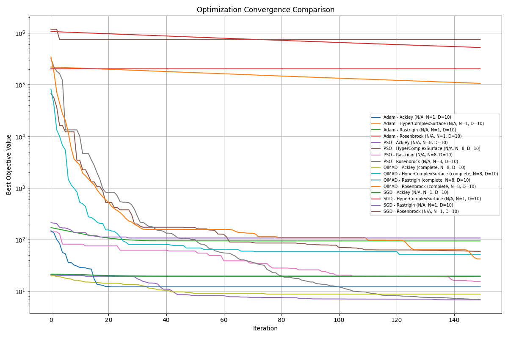

# QUIMAD — Quantum-Inspired Multi-Agent Descent

> *Un enjambre de esferas de Bloch rodando por una hipersuperficie rugosa.*

**QUIMAD** es un optimizador híbrido que combina descenso de gradiente adaptivo (RMSProp),
dinámica de enjambre multi-agente y mecánica cuántica simulada para escapar mínimos locales
en superficies de alta complejidad.

---

> **⚠️ Nota sobre el vocabulario cuántico**
>
> Usamos *inspirado en cuántica* para describir la **metáfora de diseño**, no el mecanismo
> de ejecución. QUIMAD **no explota superposición, entrelazamiento ni medición en ningún
> sentido operativo**; es un algoritmo completamente clásico que se ejecuta en una
> computadora clásica con NumPy.
>
> El vocabulario cuántico se mantiene porque nombra de forma concisa los roles estructurales
> del algoritmo —estado interno del agente, similitud entre agentes, salto exploratorio—
> y conecta a QUIMAD con la familia más amplia de
> **metaheurísticas inspiradas en cuántica** (QiEA, QPSO, AQGA, etc.).
>
> No se necesita hardware cuántico. No se necesita Qiskit ni PennyLane.
> Solo `pip install -r requirements.txt`.

---


---

## Instalación rápida

```bash
git clone https://huggingface.co/metamatematico/QUIMAD
cd QUIMAD
pip install -r requirements.txt
```

---

## Uso en 3 líneas

```python
from benchmarks import get_benchmark_function
from qimad_optimizer import QIMAD

f    = get_benchmark_function('Rastrigin', dim=10)
opt  = QIMAD(f, num_agents=8, dim=10, bounds=[-5.12, 5.12])
hist = opt.optimize(num_iterations=150)
print(f"Mejor valor encontrado: {opt.best_global_objective:.4f}")
```

---

## Correr los experimentos comparativos

```bash
python run_experiments.py
```

Compara QUIMAD contra SGD, Adam y PSO en cuatro funciones de benchmark.
Guarda resultados en `results/experiment_results.csv` y gráfica en `results/plots/convergence.png`.



---

## Ver la simulación animada

```bash
# Ventana interactiva
python simulation.py

# Guardar GIF
python simulation.py --save

# Personalizar
python simulation.py --agents 12 --iters 150 --seed 99
```

---

## Resultados actuales

> D = 10 · 150 iteraciones · 8 agentes · topología completa  
> **30 corridas independientes** (semillas 42–71) · test de Wilcoxon bilateral (α = 0.05)

### Media ± desviación estándar (↓ mejor)

| Función | QUIMAD | PSO | Adam | SGD |
|---|---|---|---|---|
| **Rastrigin** | **19.58 ± 9.46** ✓ | 27.79 ± 16.37 | 85.60 ± 18.58 | 122.98 ± 22.55 |
| **Ackley** | 10.15 ± 2.72 | **3.89 ± 4.90** ✓ | 19.49 ± 0.22 | 19.30 ± 0.72 |
| **HyperComplexSurface** | 131.65 ± 84.56 | **119.66 ± 267.52** ✓ | 83 194 ± 30 826 | 162 817 ± 75 732 |
| **Rosenbrock** | 234.05 ± 281.76 | 7 466 ± 19 992 | 464 110 ± 346 315 | 582 032 ± 248 992 |

### Test de Wilcoxon — ¿es la diferencia estadísticamente significativa?

| Función | QUIMAD vs PSO | QUIMAD vs Adam | QUIMAD vs SGD |
|---|---|---|---|
| Rastrigin | **QUIMAD** (p=0.023) | **QUIMAD** (p<0.001) | **QUIMAD** (p<0.001) |
| Ackley | PSO (p<0.001) | **QUIMAD** (p<0.001) | **QUIMAD** (p<0.001) |
| HyperComplexSurface | PSO (p=0.002) | **QUIMAD** (p<0.001) | **QUIMAD** (p<0.001) |
| Rosenbrock | Sin diferencia significativa (p=0.887) | **QUIMAD** (p<0.001) | **QUIMAD** (p<0.001) |

**Ranking por mediana: PSO 3/4 · QUIMAD 1/4 · Adam 0/4 · SGD 0/4**

### Lectura honesta de los resultados

**QUIMAD gana significativamente a PSO en Rastrigin** — la función con mayor densidad de mínimos locales. El túnel cuántico rompe la convergencia prematura que PSO no puede evitar.

**PSO supera a QUIMAD en Ackley e HyperComplexSurface** — aunque nótese que la desviación estándar de PSO en HyperComplex es 267 frente a 84 de QUIMAD: PSO es a veces brillante pero inconsistente, QUIMAD es más predecible.

**En Rosenbrock no hay diferencia estadística** entre QUIMAD y PSO (p=0.887).

**Ambos dejan muy atrás a Adam y SGD** en todos los problemas multimodales — los optimizadores de gradiente puro quedan atrapados en mínimos locales desde las primeras iteraciones.

> Los archivos `results/stats_markdown.md` y `results/stats_latex.tex` contienen
> las tablas completas listas para incluir en un paper.

---

## Estructura del proyecto

```
QUIMAD/
├── qimad_optimizer.py     # ← algoritmo principal
├── baselines.py           # SGD, Adam, PSO
├── benchmarks.py          # Rastrigin, Rosenbrock, Ackley, HyperComplexSurface
├── utils.py               # topologías de red, plotting, I/O
├── run_experiments.py     # orquestador de experimentos
├── simulation.py          # simulación 3D animada
├── config.yaml            # parámetros del experimento
├── assets/
│   ├── simulation.gif     # animación de las canicas cuánticas
│   └── convergence.png    # gráfica de convergencia comparativa
├── results/
│   └── experiment_results.csv
└── tests/
    └── test_qimad.py      # 14 tests unitarios
```

---

## El origen conceptual: canicas cuánticas

La intuición detrás de QUIMAD no viene de la teoría de optimización sino de una imagen física:

> *¿Qué pasaría si las partículas que buscan el mínimo de una función no fueran puntos sin
> estructura interna, sino esferas de Bloch que ruedan por la hipersuperficie?*

Cada agente es una **esfera de Bloch** con dos capas de descripción simultáneas:

- **Capa clásica** — posición `θ ∈ ℝᴰ` que desciende por el gradiente.
- **Capa cuántica** — orientación interna `|ψ⟩ = cos(α/2)|0⟩ + e^(iβ)sin(α/2)|1⟩`
  que evoluciona al rodar por la superficie.

Cuando dos esferas tienen estados cuánticos cercanos (alta **fidelidad** `F = |⟨ψᵢ|ψⱼ⟩|²`),
se **entrelazan** y abren un canal de información: la posición, el gradiente y la calidad del
mínimo encontrado fluyen entre ellas.

```
F < 0.55   →   agentes independientes, explorando regiones distintas
F > 0.55   →   agentes entrelazados, compartiendo información de refinamiento
```

Esto crea **grupos que emergen espontáneamente**: los que convergen al mismo mínimo colaboran
para refinarlo; los que exploran regiones distintas no se estorban.

---

## El estado cuántico como temperamento del explorador

El ángulo `α ∈ [0, π]` controla la **probabilidad de tunelamiento**:

```
α = 0    →  P(salto) = 0   →  conservador, confía en el gradiente local
α = π/2  →  P(salto) = 0.5 →  en superposición, indeciso
α = π    →  P(salto) = 1   →  temerario, siempre salta a una posición aleatoria
```

El ángulo `β ∈ [0, 2π)` determina **con quién se comunica** cada agente: aquellos cuyo `β`
apunta en la misma dirección en el espacio de Bloch tienen mayor peso de influencia mutua.

---

## Hiperparámetros clave

| Parámetro | Default | Efecto |
|---|---|---|
| `num_agents` | 8 | tamaño del enjambre |
| `eta` | 0.05 | velocidad base de descenso (RMSProp) |
| `gamma` | 0.05 | fuerza de comunicación entre agentes |
| `k` | 2 | selectividad del entrelazamiento (`F^k`) |
| `alpha_lr` | 0.03 | velocidad de rotación del estado cuántico |
| `topology` | `complete` | grafo de comunicación (`complete`, `ring`, `random`, `grid`) |

---

## Configurar experimentos

Edita `config.yaml` para cambiar qué se prueba:

```yaml
optimizers:
  QUIMAD:
    num_agents: [4, 8, 16]      # prueba los tres tamaños
    dimensions:  [5, 10, 20]    # y las tres dimensionalidades
    topology: [complete, ring]  # comparando topologías

objective_functions:
  Rastrigin:
    bounds: [-5.12, 5.12]
  HyperComplexSurface:
    bounds: [-10.0, 10.0]
```

---

## Tests

```bash
pytest tests/ -v
# 14 tests — benchmarks, topologías, SGD, Adam, PSO, QUIMAD
```

---

## Roadmap

- [ ] Migrar a PyTorch para usar QUIMAD como optimizador de redes neuronales
- [ ] Cooling schedule (reducir exploración en iteraciones tardías)
- [ ] Implementar `entanglement_strength` en el loop principal
- [ ] Benchmarks en D ≥ 50 (alta dimensionalidad)
- [ ] Comparativa con CMA-ES y DE (Differential Evolution)
- [ ] Space interactivo en Hugging Face

---

## Licencia

MIT — libre para usar, modificar y distribuir.

---

*Desarrollado como experimento de investigación en optimización cuántica inspirada.*
