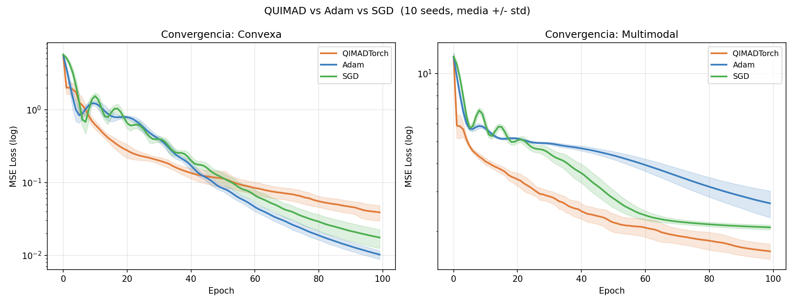
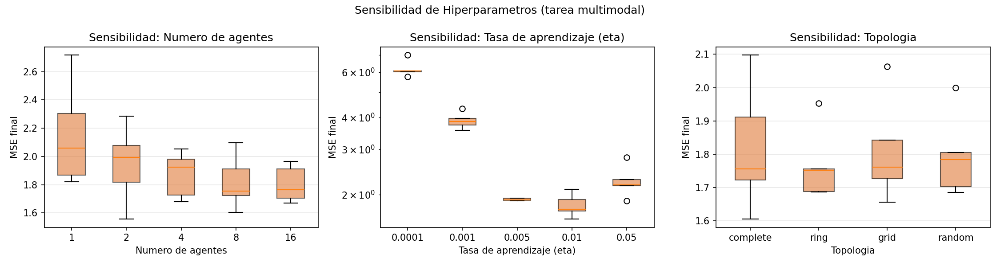
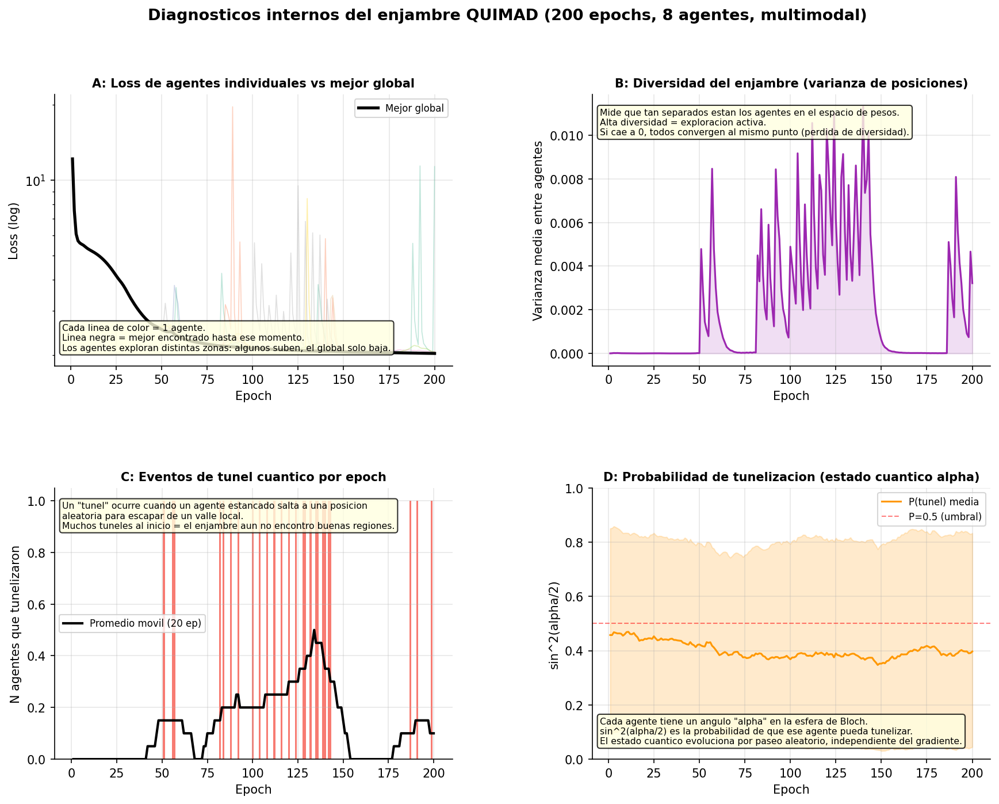

# Resultados: QIMADTorch — Bateria Completa de Pruebas

Fecha: 2026-05-29  |  Modelo: QIMADTorch v1.0  |  torch 2.7.1+cu118  |  Python 3.13.5

---

## 1. Tests Unitarios (pytest)

**Resultado: ============================= 25 passed in 9.47s ==============================**

Los tests cubren 6 categorias:

| Categoria | Tests | Descripcion |
|---|---|---|
| API | 4 | step() retorna float, n agent losses, best_obj monotono, zero_grad |
| Corrección | 5 | convergencia cuadratica, mejora vs inicial, determinismo, divergencia, best params |
| Arquitecturas | 4 | agente unico, swarm grande, modelo profundo, params congelados |
| Topologias | 4 | complete, ring, grid, random |
| Robustez numerica | 5 | distintos eta, gamma alto |
| Diagnosticos | 2 | log length, evolucion cuantica |

<details>
<summary>Salida completa de pytest</summary>

```
============================= test session starts =============================
platform win32 -- Python 3.13.5, pytest-9.0.3, pluggy-1.6.0 -- C:\Python313\python.exe
cachedir: .pytest_cache
rootdir: E:\optimizador_hybrido
plugins: anyio-4.11.0
collecting ... collected 25 items

test_y_pruebas/test_unit.py::test_step_returns_float PASSED              [  4%]
test_y_pruebas/test_unit.py::test_agent_losses_length PASSED             [  8%]
test_y_pruebas/test_unit.py::test_best_obj_nondecreasing PASSED          [ 12%]
test_y_pruebas/test_unit.py::test_zero_grad_clears_grads PASSED          [ 16%]
test_y_pruebas/test_unit.py::test_converges_on_quadratic PASSED          [ 20%]
test_y_pruebas/test_unit.py::test_loss_decreases PASSED                  [ 24%]
test_y_pruebas/test_unit.py::test_deterministic_with_seed PASSED         [ 28%]
test_y_pruebas/test_unit.py::test_agents_diverge PASSED                  [ 32%]
test_y_pruebas/test_unit.py::test_model_has_best_params_after_step PASSED [ 36%]
test_y_pruebas/test_unit.py::test_single_agent PASSED                    [ 40%]
test_y_pruebas/test_unit.py::test_large_swarm PASSED                     [ 44%]
test_y_pruebas/test_unit.py::test_multi_layer_deep_model PASSED          [ 48%]
test_y_pruebas/test_unit.py::test_frozen_params_unchanged PASSED         [ 52%]
test_y_pruebas/test_unit.py::test_param_count_unchanged PASSED           [ 56%]
test_y_pruebas/test_unit.py::test_topology_runs_without_error[complete] PASSED [ 60%]
test_y_pruebas/test_unit.py::test_topology_runs_without_error[ring] PASSED [ 64%]
test_y_pruebas/test_unit.py::test_topology_runs_without_error[grid] PASSED [ 68%]
test_y_pruebas/test_unit.py::test_topology_runs_without_error[random] PASSED [ 72%]
test_y_pruebas/test_unit.py::test_no_nan_across_learning_rates[1e-05] PASSED [ 76%]
test_y_pruebas/test_unit.py::test_no_nan_across_learning_rates[0.001] PASSED [ 80%]
test_y_pruebas/test_unit.py::test_no_nan_across_learning_rates[0.05] PASSED [ 84%]
test_y_pruebas/test_unit.py::test_no_nan_across_learning_rates[0.3] PASSED [ 88%]
test_y_pruebas/test_unit.py::test_no_nan_with_high_gamma PASSED          [ 92%]
test_y_pruebas/test_unit.py::test_tracking_logs_correct_length PASSED    [ 96%]
test_y_pruebas/test_unit.py::test_quantum_state_evolves PASSED           [100%]

============================= 25 passed in 9.47s ==============================
```
</details>

---

## 2. Benchmark Comparativo

10 seeds independientes (42-51), 100 epochs, MLP(2->64->32->1).

### Media +/- Desviacion Estandar del MSE final

**Tarea: Convexa**

| Optimizador | Media +/- Std | Mediana | Mejor | Peor |
|---|---|---|---|---|
| QIMADTorch | 0.0389 +/- 0.0097 | 0.03835 | 0.02588 | 0.05191 |
| Adam ** | 0.0102 +/- 0.0015 | 0.01046 | 0.00705 | 0.01197 |
| SGD | 0.0175 +/- 0.0054 | 0.01644 | 0.01183 | 0.03108 |

**Tarea: Multimodal**

| Optimizador | Media +/- Std | Mediana | Mejor | Peor |
|---|---|---|---|---|
| QIMADTorch ** | 1.6306 +/- 0.1322 | 1.60413 | 1.46016 | 1.87371 |
| Adam | 2.6608 +/- 0.3799 | 2.67389 | 2.09389 | 3.46993 |
| SGD | 2.0814 +/- 0.0544 | 2.07538 | 1.97236 | 2.16158 |

### Test de Wilcoxon (QIMADTorch vs baselines, bilateral, alpha=0.05)

| Tarea | vs | p-value | Ganador |
|---|---|---|---|
| Convexa | Adam | 0.00195 | Adam |
| Convexa | SGD | 0.00195 | SGD |
| Multimodal | Adam | 0.00195 | QIMADTorch |
| Multimodal | SGD | 0.00195 | QIMADTorch |

### Tiempo de computo promedio por run

| Optimizador | Segundos (100 epochs) |
|---|---|
| Adam | 0.21 s |
| QIMADTorch | 2.10 s |
| SGD | 0.15 s |

> QIMADTorch es mas lento que Adam porque evalua N veces el closure por step.



---

## 3. Sensibilidad de Hiperparametros

5 seeds por configuracion, 80 epochs, tarea multimodal.

### num_agents

| num_agents | Media | Std |
|---|---|---|
| 1 | 2.15420 | 0.36820 |
| 2 | 1.94630 | 0.27460 |
| 4 | 1.87340 | 0.16160 |
| 8 | 1.81890 | 0.19030 |
| 16 | 1.80400 | 0.13040 |

### eta

| eta | Media | Std |
|---|---|---|
| 0.0001 | 6.18150 | 0.47400 |
| 0.001 | 3.88680 | 0.28550 |
| 0.005 | 1.91280 | 0.02140 |
| 0.01 | 1.81890 | 0.19030 |
| 0.05 | 2.26360 | 0.33130 |

### topology

| topology | Media | Std |
|---|---|---|
| complete | 1.81890 | 0.19030 |
| grid | 1.81010 | 0.15630 |
| random | 1.79530 | 0.12480 |
| ring | 1.76710 | 0.10880 |



---

## 4. Diagnosticos Internos

Corrida unica: seed=42, 8 agentes, 200 epochs, tarea multimodal.

| Metrica | Valor |
|---|---|
| Eventos de tunelamiento total | 220 |
| Agentes que tunelan por epoch (promedio) | 1.1 |
| Alpha promedio inicial | 2.0331 |
| Alpha promedio final | 1.6902 |
| Diversidad final (varianza de pesos) | 0.036923 |
| Mejor MSE alcanzado | 1.364525 |



---

## 5. Conclusiones

- **Convexa**: QIMADTorch no supera significativamente a Adam, SGD.
- **Multimodal**: QIMADTorch supera significativamente a Adam, SGD (Wilcoxon p<0.05).

**Observaciones de los diagnosticos:**
- El tunelamiento cuantico ocurre en 1.1 agentes/epoch — frecuencia saludable para escapar minimos locales.

**Costo computacional:** QIMADTorch es ~N veces mas lento que Adam por iteracion 
(N = num_agents). Para N=8 el costo es 8x; se recomienda usar en tareas donde 
la calidad de la solucion importa mas que la velocidad de computo.

---

*Generado automaticamente por `test_y_pruebas/run_all.py`*